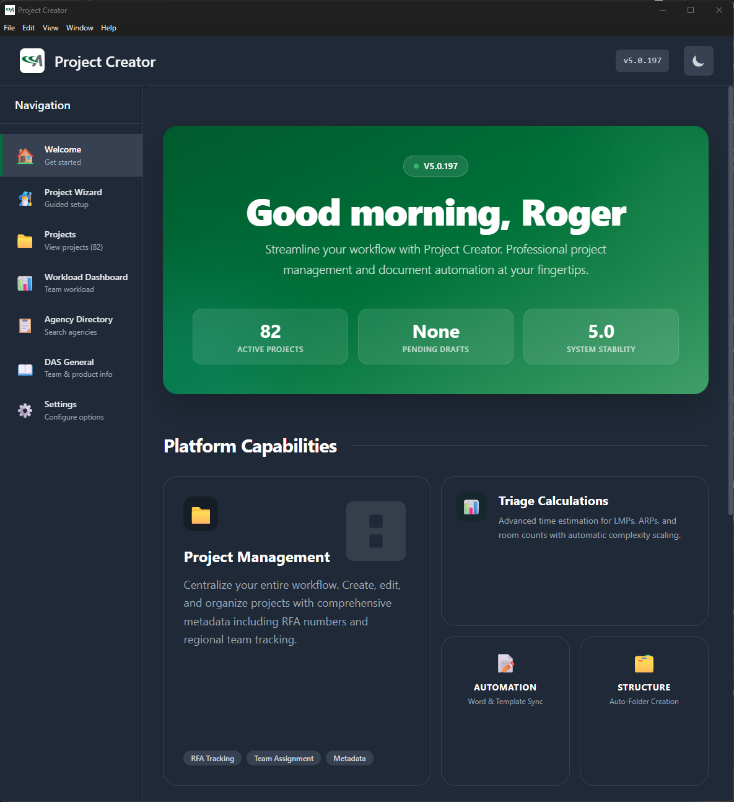

# Project Creator

<!-- AUTO:BADGES:START -->
[](package.json)
[](LICENSE)
[](https://www.electronjs.org/)
[](https://reactjs.org/)
[](https://vitejs.dev/)
[](https://tailwindcss.com/)
<!-- AUTO:BADGES:END -->

A modern Electron-based desktop application for creating and managing DAS projects, developed for Acuity Brands. This application provides a streamlined workflow for project creation, document generation, agency management, workload tracking, and Microsoft 365 integration.



<!-- AUTO:FEATURES:START -->
## Features

### Core Project Management
- **Project Wizard**: Multi-step guided project creation with auto-save, draft recovery, and duplicate detection
- **Revision Detection**: Automatically detects existing projects and copies files from previous RFA revisions
- **Project Search & Analytics**: Full-text search, filtering, and project statistics
- **Template Validation**: Validates templates and manages selection based on National Account and Agent preferences
- **Document Generation**: Automated Word document generation from templates with variable substitution

### Spec Review & BOM Analysis
- **Spec Review**: AI-powered specification analysis with file upload, review history, and knowledge base management
- **BOM Data Analysis**: Smart BOM upload with auto-detection, device breakdown, startup cost calculations, and product family analysis
- **BOM QC Review**: Building code compliance scoring, anomaly detection, and device capability analysis

### Dashboards
- **Agency Dashboard**: 8-tab dashboard with Overview, Projects, Contacts, Playbook, Email Templates, Analytics, Tasks, and Settings
- **Performance Dashboard**: Real-time metrics for response times, memory usage, and system health
- **DAS General**: Team member directory, training materials, and product information management

### Analytics & Reporting
- **Monthly Analytics Reports**: Interactive charts powered by Recharts
- **KPIs**: Total Projects, Completed, RFA Value, DAS Revenue, Turnaround Time, On-Time Rate
- **Chart Types**: Pie charts, bar charts, area charts for trends and distributions
- **Export Options**: PDF export, print mode, and multi-dimensional filtering

### Email & Communication
- **Email Template Library**: Create, manage, and organize email templates by category
- **Variable Substitution**: Dynamic placeholders for personalized emails
- **Outlook Integration**: Open emails directly in Outlook with pre-filled content
- **Batch Operations**: Send to multiple recipients efficiently

### File Operations
- **DAS Drive Upload**: Upload projects to network DAS Drive (Z:) with progress tracking
- **Ready for QC Workflow**: Scan SharePoint folders for QC zip files, download and extract
- **ZIP Creation**: Compress project folders with intelligent file filtering
- **File Watching**: Real-time monitoring of shared directories for changes

### Additional Features
- **Auto-Update**: Automatic application updates via electron-updater
- **Crash Reporting**: Error tracking with Sentry integration
- **Feature Flags**: Gradual feature rollouts with percentage-based targeting
- **Smart Defaults**: Intelligent form field suggestions based on user history
- **Migration Assistant**: Seamless migration from legacy HTA version (v4.2.5)
- **Security Logging**: Comprehensive audit trail for all file and security operations
- **Theme Support**: Dark and light mode toggle
<!-- AUTO:FEATURES:END -->

## Prerequisites

Before you begin, ensure you have the following installed:

- **Node.js** (v18 or higher) - [Download here](https://nodejs.org/)
- **npm** (v9 or higher) - Comes with Node.js
- **Git** - [Download here](https://git-scm.com/)

## Quick Start

### Installation

1. **Clone the repository**
   ```bash
   git clone <your-repository-url>
   cd ProjectCreator
   ```

2. **Install dependencies**
   ```bash
   npm install
   ```

3. **Start development mode**
   ```bash
   npm run dev
   ```

The application will launch automatically in development mode with Vite's fast hot module replacement (HMR).

## Available Scripts

### Development

- `npm start` - Start Vite development server
- `npm run dev` - Start development mode with HMR
- `npm run preview` - Preview production build locally

### Building

- `npm run build` - Build the application for production with Vite
- `npm run build:dev` - Build for development with source maps
- `npm run pack` - Package the application without creating installers

### Distribution

Create distributable packages for different platforms:

```bash
# Windows (NSIS installer and portable)
npm run dist:win

# macOS (DMG and ZIP)
npm run dist:mac

# Linux (AppImage and DEB)
npm run dist:linux

# All platforms
npm run dist

# Signed builds (without publishing)
npm run dist:signed:win
npm run dist:signed:mac
npm run dist:signed:linux
```

### Testing

- `npm test` - Run all tests with Jest
- `npm run test:watch` - Run tests in watch mode
- `npm run test:coverage` - Generate test coverage report
- `npm run test:ci` - Run tests in CI mode
- `npm run test:integration` - Run integration tests only
- `npm run test:unit` - Run unit tests only

### Security

- `npm run security:audit` - Run npm security audit
- `npm run security:fix` - Automatically fix security vulnerabilities
- `npm run security:test` - Run security tests
- `npm run security:full` - Run full security check (audit + tests)

### Version Management

<!-- AUTO:VERSION_SCRIPTS:START -->
- `npm run version:patch` - Increment patch version (5.0.233 → 5.0.234)
- `npm run version:minor` - Increment minor version (5.0.233 → 5.1.0)
- `npm run version:major` - Increment major version (5.0.233 → 6.0.0)
- `npm run version:show` - Display current version
<!-- AUTO:VERSION_SCRIPTS:END -->

## Project Structure

```
ProjectCreator/
├── src/                              # Frontend source code
│   ├── components/                   # React components
│   │   ├── wizard/                   # Project creation wizard
│   │   │   ├── ProjectWizard.jsx     # Main wizard component
│   │   │   ├── ProjectWizardStep1.jsx # Project setup step
│   │   │   ├── ProjectWizardStep2.jsx # Detailed configuration
│   │   │   └── ...                   # Supporting components
│   │   ├── settings/                 # Settings tabs
│   │   │   ├── FormSettingsTab.jsx   # Form configuration
│   │   │   ├── WorkloadTab.jsx       # Workload settings
│   │   │   └── ...                   # Other settings tabs
│   │   ├── dasgeneral/               # DAS General components
│   │   │   ├── TeamMembersTab.jsx    # Team directory
│   │   │   ├── MonthlyAnalyticsReportTab.jsx # Analytics
│   │   │   └── ...                   # Other tabs
│   │   ├── AgencyDashboard.jsx       # Agency management dashboard
│   │   ├── WorkloadDashboard.jsx     # Workload management
│   │   ├── PerformanceDashboard.jsx  # Performance metrics
│   │   ├── MonthlyAnalyticsReport.jsx # Analytics with charts
│   │   └── ...                       # Other components
│   ├── services/                     # Renderer-side services
│   │   ├── AutoUpdateService.js      # Auto-update handling
│   │   ├── CrashReportingService.js  # Sentry integration
│   │   ├── AnalyticsService.js       # User analytics
│   │   └── ...                       # Other services
│   ├── hooks/                        # Custom React hooks
│   ├── utils/                        # Utility functions
│   ├── config/                       # Frontend configuration
│   ├── App.jsx                       # Main application component
│   └── index.js                      # Application entry point
├── main-process/                     # Electron main process code
│   ├── services/                     # Backend services (40+ files)
│   │   ├── ProjectCreationService.js # Project folder creation
│   │   ├── SharePointService.js      # Microsoft Graph API
│   │   ├── OneDriveSyncService.js    # OneDrive sync detection
│   │   ├── WorkloadExcelService.js   # Excel read/write
│   │   ├── AgencyService.js          # Agency management
│   │   ├── RevisionDetectionService.js # Revision handling
│   │   └── ...                       # Other services
│   ├── config/                       # Backend configuration
│   │   └── defaultFieldMapping.json  # Excel field mappings
│   ├── constants/                    # Constants and enums
│   └── models/                       # Data models
├── assets/                           # Static assets
│   ├── images/                       # Images and logos
│   ├── icons/                        # Application icons
│   └── templates/                    # Document templates
├── docs/                             # Documentation
├── scripts/                          # Build and utility scripts
├── tests/                            # Test files
├── main.js                           # Electron main process (173 IPC handlers)
├── preload.js                        # Secure IPC preload script
├── vite.config.js                    # Vite configuration
├── tailwind.config.js                # Tailwind CSS configuration
└── package.json                      # Project dependencies
```

For a detailed breakdown, see [PROJECT-STRUCTURE.md](docs/PROJECT-STRUCTURE.md).

## Architecture

```
┌─────────────────────────────────────────────────────────────────┐
│                        React UI (Renderer)                       │
│  ┌──────────┐ ┌──────────┐ ┌──────────┐ ┌──────────────────┐   │
│  │  Wizard  │ │ Dashboards│ │ Settings │ │ Analytics/Charts │   │
│  └──────────┘ └──────────┘ └──────────┘ └──────────────────┘   │
└─────────────────────────────┬───────────────────────────────────┘
                              │ IPC (contextBridge)
┌─────────────────────────────┴───────────────────────────────────┐
│                    Electron Main Process                         │
│                     (173 IPC Handlers)                          │
│  ┌──────────────────────────────────────────────────────────┐   │
│  │                    40+ Backend Services                    │   │
│  └──────────────────────────────────────────────────────────┘   │
└──────┬──────────┬──────────┬──────────┬──────────┬──────────────┘
       │          │          │          │          │
   ┌───┴───┐ ┌───┴───┐ ┌───┴───┐ ┌───┴───┐ ┌───┴───┐
   │SharePt│ │OneDrv │ │ Excel │ │ Files │ │  DAS  │
   │Graph  │ │ Sync  │ │ Sync  │ │System │ │ Drive │
   └───────┘ └───────┘ └───────┘ └───────┘ └───────┘
```

## Technology Stack

### Core Technologies
- **[Electron](https://www.electronjs.org/)** (v38.0.0) - Desktop application framework
- **[React](https://reactjs.org/)** (v19.1.1) - User interface library
- **[Vite](https://vitejs.dev/)** (v5.4.21) - Fast build tool and dev server
- **[Tailwind CSS](https://tailwindcss.com/)** (v3.4.15) - Utility-first CSS framework

### Key Dependencies
- **[docx](https://www.npmjs.com/package/docx)** - Word document generation
- **[xlsx](https://www.npmjs.com/package/xlsx)** - Excel file handling
- **[recharts](https://recharts.org/)** - React charting library
- **[mammoth](https://www.npmjs.com/package/mammoth)** - Word document text extraction
- **[archiver](https://www.npmjs.com/package/archiver)** - Archive creation
- **[chokidar](https://www.npmjs.com/package/chokidar)** - File system watching
- **[axios](https://axios-http.com/)** - HTTP client
- **[jspdf](https://www.npmjs.com/package/jspdf)** / **[html2canvas](https://www.npmjs.com/package/html2canvas)** - PDF export
- **[fs-extra](https://www.npmjs.com/package/fs-extra)** - Enhanced file system operations

### Development Tools
- **[Jest](https://jestjs.io/)** (v30.x) - Testing framework
- **[Testing Library](https://testing-library.com/)** - React component testing
- **[Electron Builder](https://www.electron.build/)** - Application packaging
- **[electron-updater](https://www.electron.build/auto-update)** - Auto-update functionality
- **[@sentry/electron](https://docs.sentry.io/platforms/javascript/guides/electron/)** - Crash reporting

## Security Features

This application implements enterprise-grade security practices:

- **Context Isolation** - Prevents renderer process from accessing Node.js APIs
- **Secure IPC** - Uses contextBridge for safe main/renderer communication
- **Input Validation** - Comprehensive validation and sanitization of all inputs
- **Path Traversal Protection** - Blocks attempts to access parent directories
- **File Type Restrictions** - Prevents execution of dangerous file types
- **Security Logging** - Comprehensive audit trail for all operations
- **Content Security Policy** - Strict CSP headers to prevent XSS
- **Rate Limiting** - Protection against brute force attacks
- **Regular Security Audits** - Automated vulnerability scanning

For more details, see [SECURITY-AUDIT-REPORT.md](docs/SECURITY-AUDIT-REPORT.md).

## Platform Support

### Windows
- **Installer**: NSIS installer (.exe)
- **Portable**: Standalone executable
- **Architectures**: x64, ia32

### macOS
- **Installer**: DMG package
- **Archive**: ZIP file
- **Architectures**: x64 (Intel), arm64 (Apple Silicon)

### Linux
- **Packages**: AppImage, DEB
- **Architecture**: x64

## Usage

### Creating a New Project

1. Launch the application
2. Click **"Create New Project"** to start the wizard
3. **Step 1 - Project Setup**: Enter basic project information (Project Name, RFA Number, Agent Number, RFA Type)
4. **Step 2 - Configuration**: Add detailed assignments, select products, configure options
5. The wizard auto-saves drafts and detects duplicates automatically
6. Click **"Create Project"** to generate the project structure

### Using the Workload Dashboard

1. Navigate to the **Workload** tab
2. View team capacity and current assignments
3. Use **Sync Now** to synchronize with the shared Excel file
4. Manage assignments and track project distribution

### Uploading to SharePoint

1. Open a project from the Project List
2. Click the **SharePoint Upload** button
3. Choose upload method (OneDrive Sync or Direct Upload)
4. Monitor progress in the status bar

### Viewing Analytics

1. Navigate to **DAS General** → **Analytics Report** tab
2. Select date range and apply filters
3. View charts for project distribution, team performance, and trends
4. Export to PDF or print the report

## Testing

Run the test suite:

```bash
# Run all tests
npm test

# Run with coverage
npm run test:coverage

# Run in watch mode
npm run test:watch
```

Test coverage reports are generated in the `coverage/` directory.

## Documentation

Additional documentation is available in the `docs/` directory:

### Project Documentation
- [Project Structure](docs/PROJECT-STRUCTURE.md) - Detailed project organization
- [Security Audit Report](docs/SECURITY-AUDIT-REPORT.md) - Security analysis

### Microsoft 365 Integration
- [MS365 Workload Setup](docs/MS365-WORKLOAD-SETUP.md) - Setting up MS Lists integration
- [MS365 Power Automate Flows](docs/MS365-POWER-AUTOMATE-FLOWS.md) - Power Automate configuration
- [MS365 Implementation Summary](docs/MS365-WORKLOAD-IMPLEMENTATION-SUMMARY.md) - Implementation details
- [Power Automate Quick Reference](docs/POWER-AUTOMATE-QUICK-REFERENCE.md) - Quick reference guide
- [Power Automate Step-by-Step](docs/POWER-AUTOMATE-STEP-BY-STEP.md) - Detailed setup instructions
- [Power Automate Excel Alternative](docs/POWER-AUTOMATE-EXCEL-ALTERNATIVE.md) - Alternative approaches

## Contributing

We welcome contributions! Please follow these steps:

1. Fork the repository
2. Create a feature branch: `git checkout -b feature/amazing-feature`
3. Make your changes and add tests
4. Run tests and security audit: `npm test && npm run security:audit`
5. Commit your changes: `git commit -m 'Add amazing feature'`
6. Push to the branch: `git push origin feature/amazing-feature`
7. Open a Pull Request

## License

This project is licensed under the ISC License. See the [LICENSE](LICENSE) file for details.

<!-- AUTO:VERSION_HISTORY:START -->
## Version History

- **v5.0.233** (Current) - BOM Analysis and Spec Review release
  - AI-powered Spec Review with knowledge base and review history
  - BOM data analysis with device breakdown and cost calculations
  - BOM QC Review with compliance scoring and anomaly detection
  - Agency Dashboard with 8-tab interface
  - Monthly Analytics Reports with Recharts
  - Email Template system with Outlook integration
  - Performance Dashboard with real-time metrics
  - Auto-update and crash reporting

- **v5.0.84** - Major enhancement release
  - Enhanced security features
  - Project wizard with guided workflow
  - Draft recovery system
  - Migration assistant
  - Comprehensive settings management

- **v4.2.5** (Legacy) - Previous HTA version
  - Original implementation
  - Basic project creation
<!-- AUTO:VERSION_HISTORY:END -->

## Acknowledgments

Built with amazing open-source technologies:
- [Electron](https://www.electronjs.org/)
- [React](https://reactjs.org/)
- [Vite](https://vitejs.dev/)
- [Tailwind CSS](https://tailwindcss.com/)
- [Recharts](https://recharts.org/)
- And many other great libraries

---

<!-- AUTO:FOOTER:START -->
**Last Updated**: March 2, 2026  
**Current Version**: 5.0.233  
**Maintained by**: Roger Cerpa
<!-- AUTO:FOOTER:END -->
